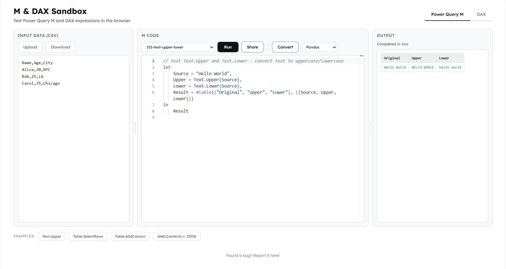
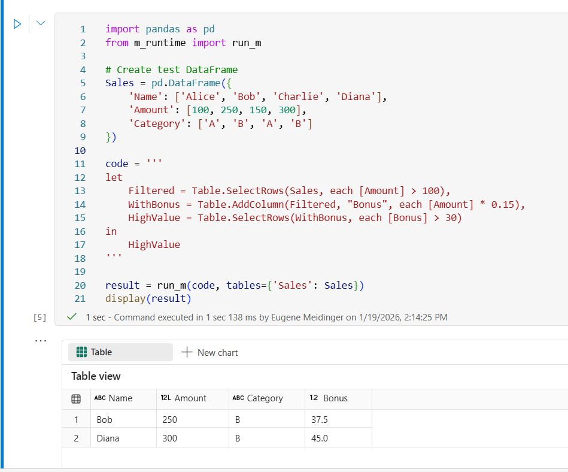

# m-dax-sandbox

This repo provides two things:

1. **[Web Sandbox](https://vibes.sqlgene.com/m-dax-sandbox/)** — Try Power Query M and DAX expressions in your browser
2. **Python Wheels** — Run M expressions locally or in Microsoft Fabric notebooks

## Web Sandbox

An interactive editor for testing Power Query M and DAX expressions without Power BI:

- Write M or DAX code with syntax highlighting
- Load sample data (CSV) or paste your own
- See results instantly in a table view
- Transpile M expressions to Python (Pandas, Polars, PySpark, DuckDB)

DAX support is in early alpha (~20 functions supported).



## Python Wheels

Run M expressions in Python. Download from [Releases](https://github.com/eugman/m-dax-sandbox/releases) or the `wheels/` folder.

| Package | Purpose |
|---------|---------|
| `python_m` | Core M runtime — evaluate M expressions |
| `m_runtime` | Helper for pandas DataFrames (useful in Fabric) |

### Install

```bash
pip install python_m-0.1.0-py3-none-any.whl
pip install m_runtime-0.1.0-py3-none-any.whl  # optional
```

Requires Python 3.10+ and pandas.

### Quick Examples

**Basic expressions:**
```python
from python_m.runtime import evaluate

evaluate('1 + 2 * 3')
# Output: 7

evaluate('Text.Upper("hello")')
# Output: 'HELLO'
```

**Tables:**
```python
result = evaluate('''
let
    Source = #table({"Name", "Age"}, {{"Alice", 30}, {"Bob", 25}, {"Carol", 35}}),
    Filtered = Table.SelectRows(Source, each [Age] > 28)
in
    Filtered
''')
print(result.to_pandas())
# Output:
#     Name  Age
# 0  Alice   30
# 1  Carol   35
```

**With DataFrames (`m_runtime`):**
```python
import pandas as pd
from m_runtime import run_m

sales = pd.DataFrame({
    'Product': ['Widget', 'Gadget', 'Widget'],
    'Amount': [100, 200, 150]
})

result = run_m('Table.SelectRows(Sales, each [Amount] > 120)', tables={'Sales': sales})
print(result)
# Output:
#   Product  Amount
# 0  Gadget     200
# 1  Widget     150
```

See [examples.md](examples.md) for more examples including Fabric notebooks, joins, and aggregations. For supported M functions, see [wheels/SUPPORTED_FUNCTIONS.md](wheels/SUPPORTED_FUNCTIONS.md).

### Microsoft Fabric

1. Upload wheel files to notebook Resources
2. Install:
   ```python
   %pip install "builtin/python_m-0.1.0-py3-none-any.whl"
   %pip install "builtin/m_runtime-0.1.0-py3-none-any.whl"
   ```
3. Use `run_m()` with your DataFrames



## Issues

Report bugs and feature requests for both the sandbox and wheels:
[GitHub Issues](https://github.com/eugman/m-dax-sandbox/issues)

## License

Copyright 2026. All rights reserved.
